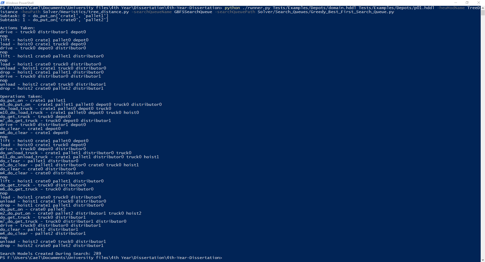
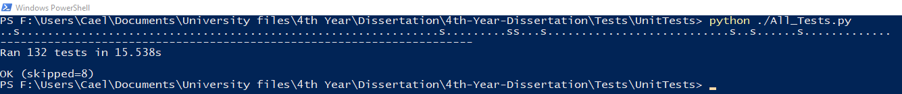

# Running the planner
There are two methods of running the planner, from the command line and by using the Runner class.

## Running from Command line
From the main project directory the planner can be initiated using the command:

```commandline
python ./Runner.py <Domain File Path> <Problem File Path>
```

Additional help can be found via the following command:
```commandline
python ./Runner --help
```

## Running Via Runner Class
The Runner class can be imported to a program and used to control the planner. The following example shows how the operations of the class can be used:

```python
from runner import Runner

controller = Runner(domain_path, problem_path)
controller.parse_problem()
controller.parse_problem()
controller.set_solver(Solver)
controller.set_search_queue(SearchQueue)
controller.set_parameter_selector(ParameterSelector)
controller.set_heuristic(Heuristic)
result = controller.solve()
```

# Example Problems
Example problems can be found in the Tests/Examples directory.

# Component Selection
Interchangeable components can be set from the command line or via the Runner class as previously seen.

Four types of component can be interchanged; Heuristics, Search Queues, Parameter Selectors, and Solvers.
When setting each of these components from the command line two pieces of information are need to be set - class names and file paths.

The following tables show the class name and file path pairs used to set components.

## Total-Order Heuristics
| **Heuristic**             | **-heuModName** | **-heuPath**                          |
|---------------------------|-----------------|---------------------------------------|
| Delete & Ordering Relaxed | DeleteRelaxed   | Solver/Heuristics/delete_relaxed.py   |
| Tree Distance             | TreeDistance    | Solver/Heuristics/tree_distance.py    |
| Hamming Distance          | HammingDistance | Solver/Heuristics/hamming_distance.py |

## Partial-Order Heuristics
| **Heuristic**             | **-heuModName**             | **-heuPath**                                        |
|---------------------------|-----------------------------|-----------------------------------------------------|
| Delete & Ordering Relaxed | DeleteRelaxedPartialOrder   | Solver/Heuristics/delete_relaxed_partial_order.py   |
| Tree Distance             | TreeDistancePartialOrder    | Solver/Heuristics/tree_distance_partial_order.py    |
| Hamming Distance          | HammingDistancePartialOrder | Solver/Heuristics/hamming_distance_partial_order.py |

## Search Queues
| **Queue Type**    | **-searchQueueName**  | **-searchQueuePath**                                    |
|-------------------|-----------------------|---------------------------------------------------------|
| Total Cost        | SearchQueue           | Solver/Search_Queues/search_queue.py                    |
| Greedy Best First | GBFSSearchQueue       | Solver/Search_Queues/Greedy_Best_First_Search_Queue.py  |
| Greedy Cost       | GreedyCostSearchQueue | Solver/Search_Queues/Greedy_Cost_So_Far_Search_Queue.py |

## Parameter Selectors
| **Selector Name**    | **-paramSelectName** | **-paramSelectPath**                                |
|----------------------|----------------------|-----------------------------------------------------|
| All Parameters       | AllParameters        | Solver/Parameter_Selection/All_Parameters.py        |
| Requirement Selector | RequirementSelection | Solver/Parameter_Selection/Requirement_Selection.py |

## Solvers
| **Solver Name**      | **-solverModName** | **-solverPath**                            |
|----------------------|--------------------|--------------------------------------------|
| Total-Order Solver   | TotalOrderSolver   | Solver/Solving_Algorithms/total_order.py   |
| Partial-Order Solver | PartialOrderSolver | Solver/Solving_Algorithms/partial_order.py |

# Output
From the command line the plan found from a problem will be displayed on screen.
Using the Runner class a plan can be printed using the following method:

```python
Runner.output_result(Result)
```

The plan found for a problem can also be written to a Pickle file. From the command line the file path for output can be set using the following argument:
```commandline
python ./Runner <Domain File> <Problem File> -w <Output File Path>
```

Using the Runner class the same output can be achieved using the following method:
```python
Runner.output_result_file(Result, file_path)
```

An example of a plan being displayed is shown below:


## Output Plan Reader 
Plans saved to Pickle files can be displayed on screen by using the plan reader tool. The plan reader can be found in the Tests/Evaluation directory.
```commandline
python ./output_plan_reader.py <Output File>
```

# Developing New Components
When developing new interchangeable components specific classes need to be inherited by any developed component.

## Heuristic
Developed Heuristics need to inherit the Heuristic class found in the Solver/Heuristics/Heuristic.py file.
There are some alternatives to inheriting the Heuristic class directly, the Pruning and NoPruning classes found in files Solver/Heuristics/pruning.py and Solver/Heuristics/no_pruning.py respectively.
Both of these classes inherit from the Heuristic class. The Pruning Class contains functionality for basic model pruning that can be inherited by other heuristics. 
The PartialOrderPruning Class from file Solver/Heuristics/partial_order_pruning.py provides the same functionality but for partial-order problems.

## Parameter Selector
Developed Parameter Selectors need to inherit the ParameterSelector Class found in file Solver/Parameter_Selection/ParameterSelector.py.

## Search Queue
Developed Search Queues need to inherit the SearchQueue class found in Solver/Search_Queues/search_queue.py.

## Solver
Developed Solvers need to inherit the Solver class within the Solver/Solving_Algorithms/solver.py file.

# Running Unittests
All the unittests can be run from the Tests/UnitTests directory using the following command:

```commandline
python ./All_Tests.py
```



# Demo Running Configurations
1. Tests/Examples/Basic/basic.hddl Tests/Examples/Basic/pb1.hddl
2. Tests/Examples/Rover/domain.hddl Tests/Examples/Rover/p01.hddl
3. Tests/Examples/Rover/domain.hddl Tests/Examples/Rover/p02.hddl -heuModName DeleteRelaxed -heuPath Solver/Heuristics/delete_relaxed.py
4. Tests/Examples/Rover/domain.hddl Tests/Examples/Rover/p02.hddl -heuModName TreeDistance -heuPath Solver/Heuristics/tree_distance.py
5. Tests/Examples/Rover/domain.hddl Tests/Examples/Rover/p05.hddl -heuModName TreeDistance -heuPath Solver/Heuristics/tree_distance.py -searchQueueName GBFSSearchQueue -searchQueuePath Solver/Search_Queues/Greedy_Best_First_Search_Queue.py
6. Tests/Examples/Partial_Order/Rover/domain.hddl Tests/Examples/Partial_Order/Rover/pfile01.hddl -heuModName HammingDistance -heuPath Solver/Heuristics/hamming_distance.py -searchQueueName GreedyCostSearchQueue -searchQueuePath Solver/Search_Queues/Greedy_Cost_So_Far_Search_Queue.py
7. Tests/Examples/Rover/domain.hddl Tests/Examples/Rover/p01.hddl -solverModName TotalOrderSolver -solverPath Solver/Solving_Algorithms/total_order.py
8. Tests/Examples/Rover/domain.hddl Tests/Examples/Rover/p01.hddl -paramSelectName AllParameters -paramSelectPath Solver/Parameter_Selection/All_Parameters.py
9. Tests/Examples/JShop/rover/rover.jshop Tests/Examples/JShop/rover/pb1.jshop